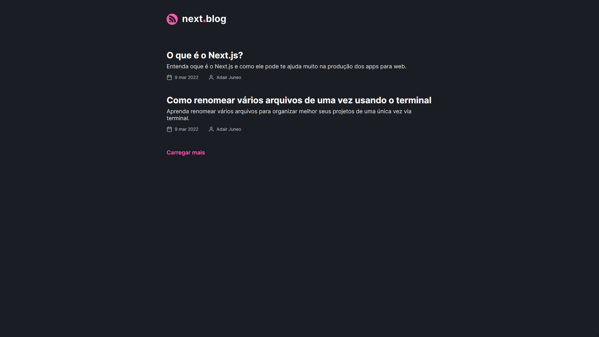

<p align="center">
  
</p>

<!-- <h1 align="center">
  
</h1> -->

## 💻 Template - next.blog

<p align="center">
  
</p>

Você pode acessar o projeto WEB clicando neste link [acessar projeto](https://blog-template-adairjuneo.vercel.app/)

O next.blog é um template de blog que pode ser utilizado em qualquer cenário, onde o intuito seja disponibilizar um contéudo atraves de um artigo ou publicação simples para comunidade. É necessário apenas que o seu site ou aplicação já utilize React e NextJS, a integração será bem rápida. Para criar as publicações, utilizei o Prismic.io, um CMS gratuito e muito prático, além da facilidade de integração com o ambiente do NextJS.

## 🧪 Tecnologias

Esse projeto foi desenvolvido com as seguintes tecnologias:

- [React](https://reactjs.org)
- [NextJS](https://nextjs.org)
- [TypeScript](https://www.typescriptlang.org/)

## 📚 Bibliotecas

Para auxiliar no desenvolvimento do projeto, utilizei as seguinte bibliotecas:

- [SASS](https://sass-lang.com/)
- [date-fns](https://date-fns.org/docs/Getting-Started)
- [Prismic.io](https://prismic.io/)

## 👨🏻‍💻 Como utilizar

Lembre-se de criar uma conta no Prismic.io e disponibilizar o endpoit do seu workspace do Prismic no arquivo `prismic.ts` dentro da pasta `src/services`. No meu caso, utilizei uma variável global chamada `PRISMIC_API_ENDPOINT` por que o app também está em produção.

Para iniciá-lo, siga os passos abaixo:

```bash
# Instalar as dependências
$ yarn
# Iniciar o projeto
$ yarn dev
```

O app estará disponível no seu browser pelo endereço http://localhost:3000.
